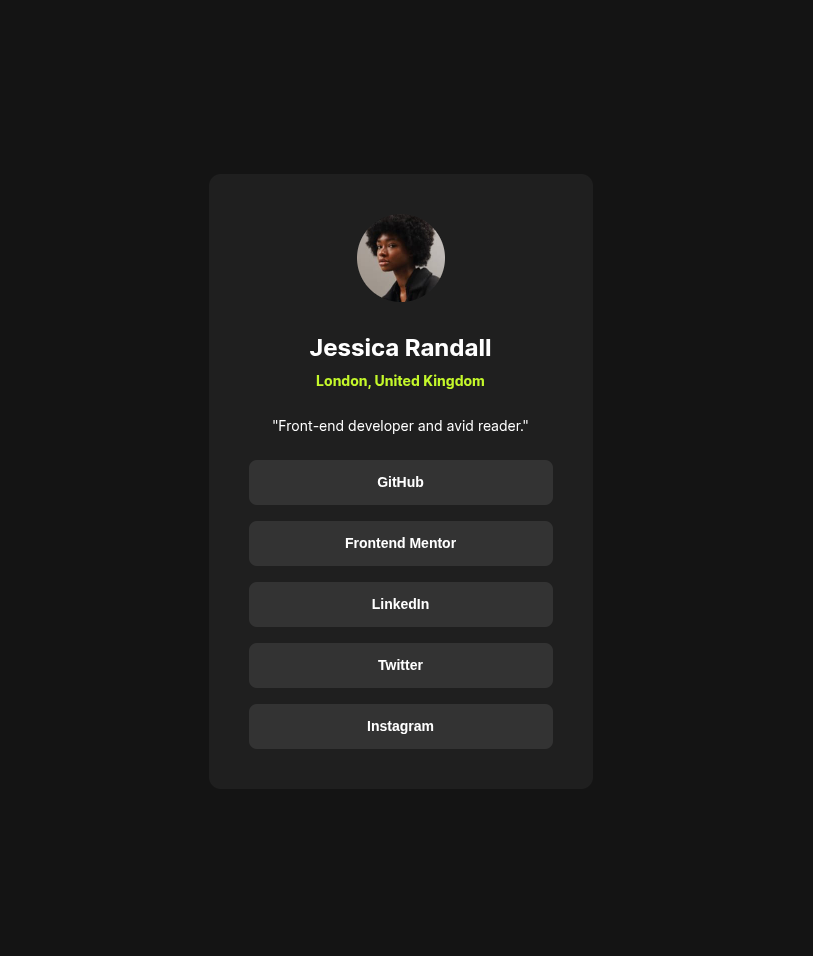

# Frontend Mentor - Social links profile solution

This is a solution to the [Social links profile challenge on Frontend Mentor](https://www.frontendmentor.io/challenges/social-links-profile-UG32l9m6dQ). Frontend Mentor challenges help you improve your coding skills by building realistic projects. 

## Table of contents

- [Overview](#overview)
  - [The challenge](#the-challenge)
  - [Screenshot](#screenshot)
  - [Links](#links)
- [My process](#my-process)
  - [Built with](#built-with)
  - [What I learned](#what-i-learned)
  - [Continued development](#continued-development)
  - [Useful resources](#useful-resources)
  - [AI Collaboration](#ai-collaboration)
- [Author](#author)

## Overview

### The challenge

Users should be able to:

- See hover and focus states for all interactive elements on the page

### Screenshot



### Links

- Solution URL: [GitHub](https://github.com/ryanwells-rwc/social-links-profile-main)
- Live Site URL: [Netlify](https://social-links-profile-main-rwc.netlify.app)

## My process

### Built with

- Semantic HTML5 markup
- CSS custom properties
- Flexbox

### What I learned

I learned how to make a container's size hug the content within it.

```css
.card {
  display: flex;
  flex-direction: column;
  align-items: center;
  min-width: 384px;
  height: fit-content;
  background-color: var(--c-gray-800);
  border-radius: 12px;
  padding: var(--size-500);
}
```

### Continued development

I plan to learn more about how to make sizes fluid across different screen sizes.

### Useful resources

- [Example resource 1](https://www.example.com) - This helped me for XYZ reason. I really liked this pattern and will use it going forward.
- [Example resource 2](https://www.example.com) - This is an amazing article which helped me finally understand XYZ. I'd recommend it to anyone still learning this concept.

**Note: Delete this note and replace the list above with resources that helped you during the challenge. These could come in handy for anyone viewing your solution or for yourself when you look back on this project in the future.**

### AI Collaboration

Describe how you used AI tools (if any) during this project. This helps demonstrate your ability to work effectively with AI assistants.

- What tools did you use (e.g., ChatGPT, Claude, GitHub Copilot)?
- How did you use them (e.g., debugging, generating boilerplate, brainstorming solutions)?
- What worked well? What didn't?

**Note: Delete this note and the content above if you didn't use AI, or replace with your own experience.**

## Author

- Website - [Ryan Wells](https://ryanwells.io)
- Frontend Mentor - [@ryanwells-rwc](https://www.frontendmentor.io/profile/ryanwells-rwc)
